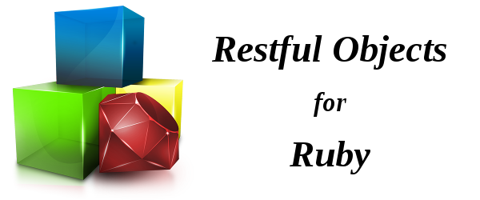

### What's it about?
It's a framework for developing servers that adhere to the [Restful Objects specification](http://restfulobjects.org/). It's main purpose is to be completely transparent to the developer and let him focus mainly on the Domain Model that implements the business logic, thereby abstracting him from the API & HTTP issues of exposing the Restful resources.

So it's like plain old ruby objects, with HTTP Restful steroids for free!

### How it looks like?
```ruby
require 'restful_objects'

class Node
  include RestfulObjects::Object

  property   :label, :string
  property   :visited, :bool
  collection :dendencies, Node
end

class Graph
  include RestfulObjects::Object

  collection :nodes, Nodo
  action :topological_sort, return_value: { list: Nodo }

  def topological_sort
    list = []
    nodex.each { |node| node.visited = false }
    unvisited_nodes = nodes
    while not unvisited_nodes.empty? do
      visit(unvisited_nodes.pop, list)
    end
    list
  end

  private

  def visit(node, list)
    if !node.visited
      node.dependencies.each { |dependent_node| visit(dependent_node, list) }
      node.visited = true
      list << node
    end
  end
end
```

### Examples
- [https://github.com/vizcay/ro_topological_sort](https://github.com/vizcay/ro_topological_sort).

### How to install it?
Run

```shell
gem install restful_objects
```

or add 

```ruby
gem 'restful_objects'
```

to your's project Gemfile and 'bundle install' it.

### Project Status
The source quality is at alpha state, and it was created mostly as a proof of concept. Still is has plenty of specs and a big percentage of the specification implemented, the grey areas are mostly related to errors and validations. It has been developed with MRI and hasn't been tested on other Ruby implementations.

### Dependencies
- [Ruby 1.9.3 or higher](https://www.ruby-lang.org/)
- [Sinatra](http://www.sinatrarb.com/)
- [RSpec](http://rspec.info/)
- [json_expressions](https://github.com/chancancode/json_expressions) for json testing.

### Resources
- [Restful Objects Spec](http://restfulobjects.org/)
- [Introduction to Restful Objects](http://www.infoq.com/articles/Intro_Restful_Objects)

### License
MIT License.

### Credits
This project has been developed as the main subject of Pablo Vizcay undergradute System's Engineering thesis, directed by [Dr. Alejandro Zunino](http://azunino.sites.exa.unicen.edu.ar/) for the [U.N.I.C.E.N. University in Tandil - Buenos Aires - Argentina](http://www.exa.unicen.edu.ar/).


